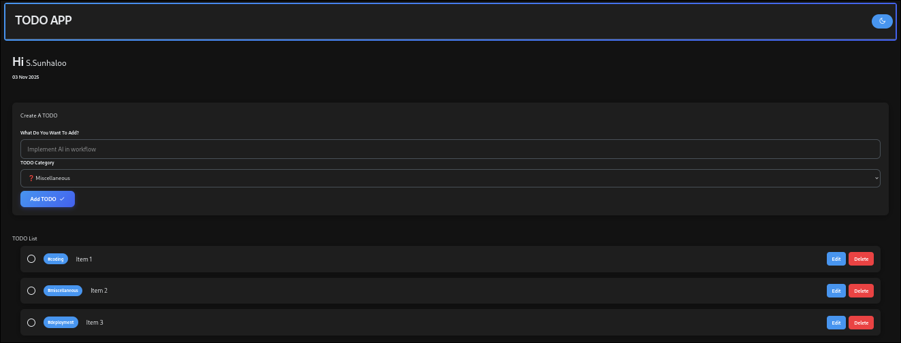

# Simple TODO Application

Simple TODO Application written in 'HTML', 'CSS' and Javascript.

> Hosted using GitHub Pages over at <https://sunhaloo.github.io/Simple-HTML-CSS-JS-TODO>.

> [!INFO]
> These are the following resources that I used when learning to make this:
>
> - [Tyler Potts](https://www.youtube.com/watch?v=6eFwtaZf6zc)
>   - Project GitHub Link: <https://github.com/TylerPottsDev/yt-js-todo-2022>
> - [Web Dev Tutorials](https://www.youtube.com/watch?v=SeKQSQDUMDQ)
>
> There are also many resources that I used and to be honest AI did help me with the front-end.

# Features

- 'Light' and 'Dark' Themes
- Category with each TODO item
- Ability to **edit** TODO item ( _content only and not category_ )4
- Ability to **delete** TODO item

# Usage

Upon entering the web page, you are going to be greeted with this page:

Therefore, the user is going to be able to:

1. Enter his username
2. Write a TODO item
3. Add a category to that TODO item
4. Write that TODO item to the local storage
5. The user will be able to check-off the TODO item
6. The user is able to edit the content of the TODO item created
7. The user is able to delete the TODO item entirely

---

## Some Screenshots

- Light Mode:

- Dark Mode:
  
